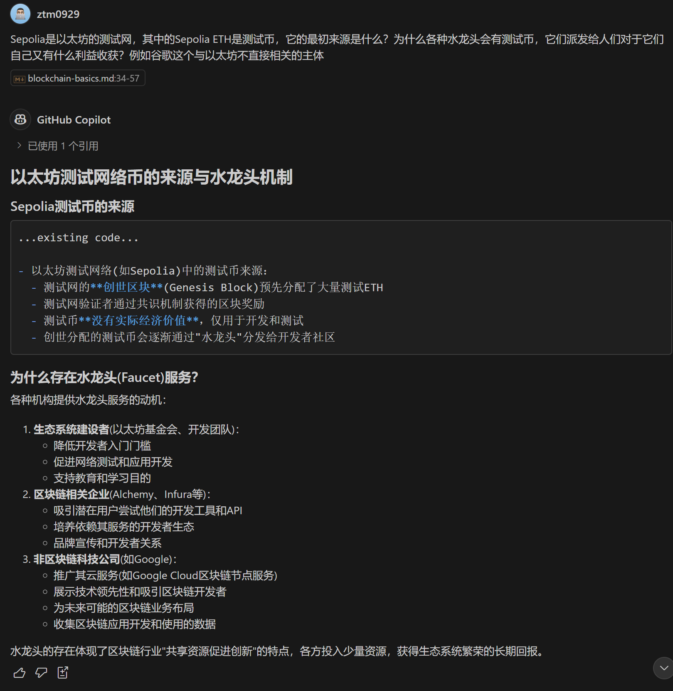

> 请在上边的 timezone 添加你的当地时区(UTC)，这会有助于你的打卡状态的自动化更新，如果没有添加，默认为北京时间 UTC+8 时区

# Kevin

1. 一个学生，一个编程小白
2. 有信心完成本次共学
3. https://t.me/ztm0929

## Notes

<!-- Content_START -->

### 2025.02.27

本次共学活动有一个 LXPU 激励，本小白完全不懂这是什么，我可以如何与它交互，也许可以趁着这次学习详细了解下。

根据[说明](https://lxdao.notion.site/LXDAO-Q-A-b77d0c920acc408caec0b26ea5c5efec)，LXPU 是 LXP + U ，1000 LXPU = 800 USD + 200 LXP

USD 好理解，就是美元。那么问题来了，LXP 如何获取呢？还是说 LXPU 获取的时候就包含了 USD 和 LXP ？

再根据另一份[文档说明](https://docs.lxdao.io/lxdao/jing-ji-mo-xing/gong-xian-zheng-ming-lxp)，LXP 部署在 Polygon 网络里，
因此我尝试使用 [Etherscan](https://etherscan.io/address/0x58A05eeBF1df2817DD4FFC3c9b1cCE0421318ba1) 和 [PolygonScan](https://polygonscan.com/address/0x58A05eeBF1df2817DD4FFC3c9b1cCE0421318ba1) 来搜索看看。

**我应该如何查看当前人们拥有的 LXP 数量呢？以及过往的转移记录呢？**

### 2025.02.28

- 一个 dApp 通常是多个智能合约的组合

- 我们需要从 Brand Based 的理念转为 Math Based。

### 2025.03.03

Transaction Fee 和 Gas Price：

- 计算越复杂，Gas 越高
- Gwei = 1 ETH * 10^-9 ，Gwei 作为单位本身是不变的
- Gas Price 是你愿意为 Gas 消耗支付多少 Gwei，通常来说，Gas Price 越高（例如 50 Gwei），交易优先级更高（50 Gwei 比 10 Gwei 更受矿工青睐）

笔记内容

### 2025.03.04

- 钱包的助记词可以访问整个钱包，钱包可以创建多个账户，钱包的助记词需要仔细保管！账户的私钥只能访问单个账户。
- 地址并不完全等同于公钥，但它是从公钥经过一系列哈希变换生成的。可以理解为地址是公钥的"压缩"版本，它的设计目的是为了更短、更安全地表示公钥。

### 2025.03.05

- 区块链扩容层级结构可以这样理解：
  - **Layer 1 (基础层)**:
    - 主区块链网络本身，如比特币、以太坊主网
    - 负责最终的交易结算与安全保障
    - 拥有完整的去中心化特性，但吞吐量有限
  - **Layer 2 (扩展层)**:
    - 建立在Layer 1之上的扩展解决方案
    - 在链外处理大量交易，定期将结果提交到Layer 1
    - 继承Layer 1安全性，同时提高性能、降低费用
  - **Rollup (卷叠技术)**:
    - Layer 2的主要实现方式之一，与侧链(Sidechains)等非Rollup等方案相比，安全性较高
    - 将多笔交易"打包"处理后，只向主链提交概要数据
    - 分两种类型：
      - **Optimistic Rollup (乐观卷叠)**: 假设交易有效，有争议期(通常7天)，如Optimism、Arbitrum
      - **ZK-Rollup (零知识卷叠)**: 使用数学证明验证交易有效性，无需争议期，如zkSync、StarkNet
- 通俗比喻：如果把区块链比作交通系统
  - Layer 1 是主干道：安全但容易拥堵
  - Layer 2 是快速辅路：分流主干道交通
  - Rollup 是公交车：一次运送多人，只占一个车位的空间
- 附一则AI对测试币和水龙头来源的简答：

### 2025.03.06

- Solidity 的主要数据类型有 `uint`、`int`、`address`、`bytes`。

### 2025.03.07

- 了解了一点点铭文的概念，原来它与 NFT 的差别有些大

> **铭文 ≠ 传统 NFT**
> 
> 虽然铭文可以用于类似 NFT 的应用（如图片、文字、艺术品等），但它和以太坊上的 NFT 机制不一样：

> **存储方式不同**
> 
> 铭文（Ordinals）：数据直接存储在比特币区块链的区块里，不依赖外部存储（如 IPFS）。
> NFT（以太坊等）：通常只是存储指向外部数据的链接，数据本身可能存放在 IPFS 或其他去中心化存储服务上。

> **智能合约 vs. 纯交易**
> 
> NFT 依赖智能合约（如以太坊的 ERC-721 或 ERC-1155 标准）来定义拥有权、交易规则等。
> 铭文不需要智能合约，它只是利用比特币的 UTXO 机制，把数据直接附加到交易输入里，从而实现“铭刻”。

> **不可变 vs. 可升级**
> 
> 铭文是不可更改的，一旦刻在比特币区块链上，内容就无法修改或删除。
> NFT 可以升级或修改，因为它们的元数据（Metadata）通常存储在链下，并由智能合约管理。

### 2025.03.09

- GameFi（游戏金融，Game Finance）是 Game（游戏）+ DeFi（去中心化金融） 的结合，指的是将 区块链技术、NFTs（非同质化代币）、加密货币 和 去中心化金融（DeFi）整合进游戏生态系统的一种模式。GameFi 的核心理念是 Play-to-Earn（P2E，边玩边赚），玩家可以在游戏过程中通过完成任务、竞争对战或交易游戏资产来获得真实的经济回报。
- 但我觉得这只是将高风险投资（当然也可以是高收益）游戏化了而已。

### 2025.03.10

- 了解了 [Safe 钱包](https://app.safe.global/)的基本概念，它作为团队小金库，通过多重签名账户提前地设置来确保支出的控制，兼顾安全的同时保持了智能合约的快捷。

### 2025.03.11

- How to DeFi 似乎并没有讲到那些输钱的人，事实上，绝大多数介绍区块链的文章都只讲到了它的”高收益“，”高风险“的概念我几乎只有在 LXDAO 的一些地方看到过提示。

### 2025.03.13

Farcaster 是一个去中心化社交协议，允许用户在不同的应用程序中拥有并携带他们的社交身份和数据。它基于 Ethereum 和 Optimism（Layer 2 解决方案），旨在打造一个开放、可扩展的社交网络生态。任何开发者都可以基于 Farcaster 协议构建社交应用，而用户的数据和社交关系不会被某个平台所垄断。

Warpcast 是 Farcaster 协议上的一款应用，相当于 Farcaster 生态中的 Twitter。Warpcast 是目前最主流的 Farcaster 客户端，由 Farcaster 的核心团队开发。它提供了类似 Twitter（X）的体验，但底层架构是去中心化的，所有内容存储在 Farcaster 网络上，而不是由 Warpcast 独占。

它们的关系

Farcaster 是协议，类似于 HTTP、SMTP 这样的标准，任何人都可以基于它开发应用。

Warpcast 是 Farcaster 上最受欢迎的社交应用，类似于 Twitter（X）或 Bluesky 上的官方客户端。

可以把 Warpcast 视为 Farcaster 的官方应用，但并不是唯一的应用，其他开发者也可以创建基于 Farcaster 的不同社交产品。

### 2025.03.14

- “跨链桥”（Cross-Chain Bridge）是一种连接不同区块链网络的技术，使得用户或智能合约能够在不同链之间转移资产、数据或执行互操作性操作。跨链桥通常会在起始链上的智能合约中锁定或销毁通证，并通过目标链上的另一个智能合约解锁或铸造通证。
- 参考文章：[一文读懂跨链桥](https://blog.chain.link/cross-chain-bridge-zh/)

### 2025.03.15

开个坑，列举产业链里的各个实体。

- 上游-投资机构
  - 风险投资（VC）与孵化器：
  - 技术基金会：以太坊基金会
- 上游-区块链协议层
  - 公链开发
  - 共识机制
  - 智能合约平台
- 上游-加密技术与安全
  - 安全审计
  - 隐私协议
  - 密码学算法
- 上游-节点与矿工生态
  - 矿工/验证者
  - 分布式存储
  - 去中心化网络
- 上游-开发工具与中间件
  - 跨链桥
  - 预言机
  - SDK/API
 
 ### 2025.03.16

 - 中游-投资机构
   - 加密对冲基金
   - 生态基金
   - DAO 国库与社区基金
 - 交易与流动性服务
   - 中心化交易所
   - 去中心化交易所
   - 做市商与流动性池
 - 资产管理工具
   - 托管钱包
   - 非托管钱包
   - 资产托管服务
- DeFi（去中心化金融）
  - 稳定币
  - 衍生品
  - 借贷协议
- NFT 与元宇宙生态
  - NFT 市场
  - 元宇宙平台
  - 数字内容创作工具
- DAO 与治理
  - 去中心化自治组织
  - 治理代币与投票机制
- 合规与金融服务
  - 合规交易所
  - 加密支付网关
  - 税务与法务咨询

### 2025.03.17
 
- 简单了解了 Polygon 的历史，[十大公链介绍——Polygon（matic）是什么？](http://www.btcwbo.com/6427.html)
- Polygon 是一个第 2 层解决方案，旨在通过提高交易速度、降低费用以及优化开发人员体验来扩展以太坊区块链。 
与大多数依赖于单一方法的扩展解决方案不同，Polygon 最初称为 “Matic Network，”提供了几种不同的扩展解决方案，并服务于一系列用例，包括去中心化金融 (DeFi)、非同质化代币 (NFT)、付款和游戏。

### 2025.03.18

- 看了 [Mastering Ethereum](https://github.com/ethereumbook/ethereumbook) 第一章，对 Gas 机制的设计原因有了一点了解，以太坊与比特币相比，图灵完备，更加灵活，但是风险也更大，需要避免可能存在的合约的死循环执行👀

<!-- Content_END -->
